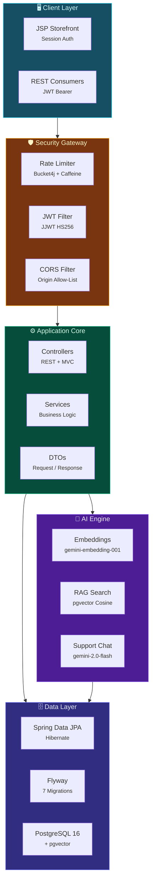
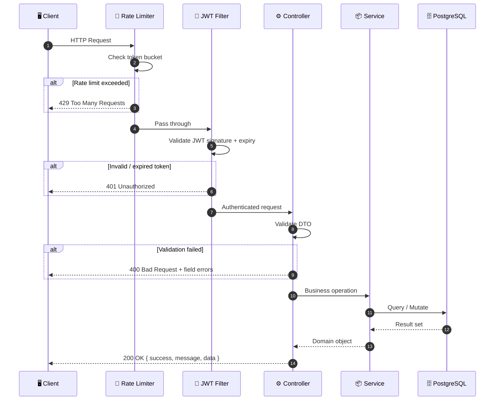
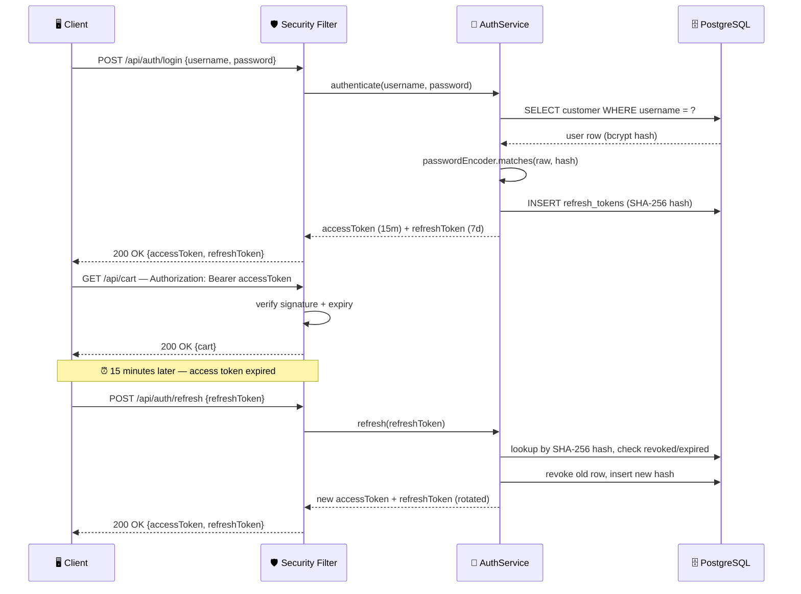
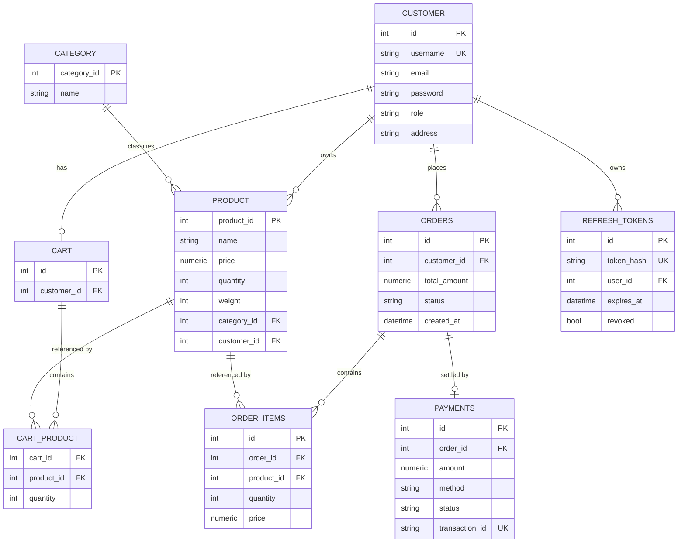
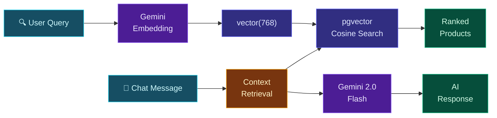

<div align="center">

<br/>



<br/><br/>

# 🛒 E-Commerce Platform

### A production-grade Spring Boot storefront with JWT-secured REST API, AI-powered search & Gemini chatbot

<br/>

[](https://openjdk.org/)
[](https://spring.io/projects/spring-boot)
[](https://www.postgresql.org/)
[](https://ai.google.dev/)
[](https://www.docker.com/)
[](https://github.com/pavansaiambala7/ecommerce_project_spring-boot/actions/workflows/ci.yml)

<br/>

<p>
  <a href="#-quick-start">Quick Start</a> •
  <a href="#-architecture">Architecture</a> •
  <a href="#-features">Features</a> •
  <a href="#-api-reference">API Reference</a> •
  <a href="#-database-schema">Database Schema</a> •
  <a href="#-ai-features">AI Features</a> •
  <a href="#-testing">Testing</a>
</p>

<sub>The architecture diagram above is a live SVG — view it on GitHub to see the animated request/response flow ✨</sub>

</div>

<br/>

---

<br/>

## 📖 Overview

A **single Spring Boot application** — not a microservice fleet — with two front doors onto the same domain layer:

| Channel | Type | Auth |
|---------|------|------|
| **JSP Storefront** | Server-rendered pages | Session / form login |
| **REST API** | Stateless JSON endpoints | JWT bearer tokens |

Backed by **PostgreSQL 16 + pgvector**, with optional **AI product search** and a **support chatbot** powered by Google Gemini.

<br/>

---

<br/>

## ⚡ Quick Start

### 🐳 Docker Compose *(recommended)*

```bash
# Generate a signing secret (required — app refuses to boot without one)
export JWT_SECRET="$(openssl rand -base64 48)"

# Optional: enable AI features
export GEMINI_API_KEY="your-gemini-api-key"

# Launch
docker compose up --build
```

> App is live at **http://localhost:8080** 🚀

### 🔧 Without Docker

Requires **JDK 17** and **PostgreSQL 16** with `vector` + `pg_trgm` extensions.

```bash
# Start PostgreSQL with pgvector
docker run -d --name ecommerce-db -p 5432:5432 \
  -e POSTGRES_DB=ecommjava \
  -e POSTGRES_USER=postgres \
  -e POSTGRES_PASSWORD=postgres \
  pgvector/pgvector:pg16

# Run the app
export JWT_SECRET="$(openssl rand -base64 48)"
./mvnw spring-boot:run -Dspring-boot.run.profiles=dev
```

Flyway automatically creates and migrates the schema on startup. The `dev` profile enables SQL logging.

### 🔑 Demo Accounts

| Username | Password | Role |
|:--------:|:--------:|:----:|
| `admin` | `123` | `ROLE_ADMIN` |
| `lisa` | `765` | `ROLE_NORMAL` |

> [!WARNING]
> These are well-known credentials seeded by a migration in every environment. **Rotate or delete them before deploying to production.** See [Security Notes](#-security-notes).

<br/>

---

<br/>

## 🏗 Architecture

The system is organized in five distinct layers, each with a clear responsibility boundary:



### Layer Responsibilities

| Layer | Components | Purpose |
|-------|-----------|---------|
| **Client** | JSP Views, REST Consumers | User-facing interfaces |
| **Security** | Rate Limiter → JWT Filter → CORS | Defense in depth, runs before any business logic |
| **App Core** | Controllers, Services, DTOs, Validation | Domain logic, entities never exposed directly |
| **AI Engine** | Gemini Embeddings, RAG Search, Chat | Optional intelligence layer, inert without API key |
| **Data** | JPA Repositories, Flyway, PostgreSQL | Persistence, migrations, vector similarity search |

### Request Lifecycle



<br/>

---

<br/>

## ✨ Features

<table>
<tr>
<td width="50%">

### 🔐 Authentication & Security
- **JWT access + refresh tokens** — 15min / 7day rotation
- Refresh tokens stored as **SHA-256 hashes**
- **Rotate-on-use** — stolen token usable at most once
- Per-session or account-wide **revocation**
- Constant-time password comparison (no user enumeration)
- **CORS** explicit origin allow-list

</td>
<td width="50%">

### 🚦 Rate Limiting
- **Bucket4j** token-bucket ahead of Spring Security
- Tiered by endpoint sensitivity
- IP-keyed with configurable XFF trust
- `X-RateLimit-Limit` / `Remaining` headers
- `429` includes `Retry-After`

| Endpoint | Limit |
|----------|-------|
| `/api/chat/**` | 10 / min |
| `/api/search/reindex` | 2 / hour |
| `/api/search/**` | 30 / min |
| Auth endpoints | 5 / min |
| `/api/**` (default) | 100 / min |

</td>
</tr>
<tr>
<td>

### 🛒 Cart & Checkout
- Add / update / remove items
- One unique cart per customer
- **Checkout under stock row-lock** — no overselling
- Automatic order creation with line items
- Full order lifecycle (create → pay → cancel)

</td>
<td>

### 🤖 AI Intelligence
- **RAG product search** — Gemini embedding → pgvector cosine similarity → ranked results
- **Support chatbot** — contextual conversation with product/order retrieval
- **Bounded session memory** per user
- Admin-only **reindex** with rate protection
- Fully optional — inert without `GEMINI_API_KEY`

</td>
</tr>
<tr>
<td>

### 🧱 Database Migrations
- **7 Flyway versioned migrations** (V1–V7)
- Schema validated against entities on every boot
- Money stored as `numeric(12,2)`
- pgvector `vector(768)` for embeddings

</td>
<td>

### ✅ Comprehensive Testing
- **154 tests** across all layers
- Unit, `@WebMvcTest` slices, integration
- Real PostgreSQL via **Testcontainers**
- Authorization matrix tested with **real filter chain**
- **JaCoCo** coverage reporting

</td>
</tr>
</table>

<br/>

---

<br/>

## 🔧 Configuration

All configuration is via environment variables. Only `JWT_SECRET` is mandatory.

| Variable | Default | Purpose |
|----------|---------|---------|
| `JWT_SECRET` | *(none — startup fails)* | HMAC-SHA signing key, ≥ 32 bytes |
| `SPRING_DATASOURCE_URL` | `jdbc:postgresql://localhost:5432/ecommjava` | Database JDBC URL |
| `SPRING_DATASOURCE_USERNAME` | `postgres` | Database user |
| `SPRING_DATASOURCE_PASSWORD` | `postgres` | Database password |
| `GEMINI_API_KEY` | *(empty)* | Enables AI search and chat |
| `CORS_ALLOWED_ORIGINS` | `http://localhost:3000,http://localhost:8080` | Comma-separated origin allow-list |
| `RATELIMIT_TRUST_XFF` | `false` | Trust `X-Forwarded-For` for rate-limit identity |

> [!IMPORTANT]
> There is **deliberately no default signing secret**. A fallback baked into source control is equivalent to no authentication, so the app refuses to boot without one.

> [!CAUTION]
> Set `RATELIMIT_TRUST_XFF=true` **only** behind a reverse proxy you control that overwrites the `X-Forwarded-For` header. Otherwise, callers can set it themselves and bypass rate limiting entirely.

<br/>

---

<br/>

## 🔐 Authentication

The REST API is stateless and authenticates with JWT bearer tokens. The JSP pages use ordinary session form-login.

```bash
# Login
curl -s -X POST localhost:8080/api/auth/login \
  -H 'Content-Type: application/json' \
  -d '{"username":"admin","password":"123"}'

# Use the token
curl -s localhost:8080/api/cart \
  -H "Authorization: Bearer $ACCESS_TOKEN"
```

### Token Lifecycle



| Property | Value |
|----------|-------|
| Access token TTL | **15 minutes** |
| Refresh token TTL | **7 days** |
| Refresh storage | **SHA-256 hash** only |
| Rotation | **Every use** — one-time per token |
| Revocation | Per-session (`/logout`) or all sessions (`/logout-all`) |

<br/>

---

<br/>

## 📡 API Reference

Every response uses a consistent envelope:

```json
{
  "success": true,
  "message": "Success",
  "data": { },
  "timestamp": "2025-01-01T00:00:00Z"
}
```

Validation failures include an `errors` object keyed by field name.

<details>
<summary><b>🔑 Auth</b></summary>
<br/>

| Method | Endpoint | Access |
|:------:|----------|:------:|
| `POST` | `/api/auth/login` | Public |
| `POST` | `/api/auth/register` | Public |
| `POST` | `/api/auth/refresh` | Public |
| `POST` | `/api/auth/logout` | Authenticated |
| `POST` | `/api/auth/logout-all` | Authenticated |

</details>

<details>
<summary><b>📦 Products</b></summary>
<br/>

| Method | Endpoint | Access |
|:------:|----------|:------:|
| `GET` | `/api/products` | Public |
| `GET` | `/api/products/paged` | Public |
| `GET` | `/api/products/{id}` | Public |
| `POST` | `/api/products` | Admin |
| `PUT` | `/api/products/{id}` | Admin |
| `DELETE` | `/api/products/{id}` | Admin |

**Pagination**: `/api/products/paged` accepts `page`, `size` (1–100), `sortBy` (`id`, `name`, `price`, `quantity`, `weight`), and `direction`.

</details>

<details>
<summary><b>🛒 Cart</b></summary>
<br/>

| Method | Endpoint | Access |
|:------:|----------|:------:|
| `GET` | `/api/cart` | Owner |
| `POST` | `/api/cart/items` | Authenticated |
| `PUT` | `/api/cart/items/{productId}` | Owner |
| `DELETE` | `/api/cart/items/{productId}` | Owner |
| `DELETE` | `/api/cart` | Owner |
| `POST` | `/api/cart/checkout` | Owner |

</details>

<details>
<summary><b>📋 Orders & Payments</b></summary>
<br/>

| Method | Endpoint | Access |
|:------:|----------|:------:|
| `POST` | `/api/orders` | Authenticated |
| `GET` | `/api/orders/me` | Authenticated |
| `GET` | `/api/orders/{id}` | Owner / Admin |
| `GET` | `/api/orders/user/{userId}` | Self / Admin |
| `POST` | `/api/orders/{id}/cancel` | Owner / Admin |
| `PATCH` | `/api/orders/{id}/status` | Admin |
| `POST` | `/api/payments` | Order Owner |
| `GET` | `/api/payments/order/{orderId}` | Owner / Admin |
| `POST` | `/api/payments/refund/{orderId}` | Admin |

</details>

<details>
<summary><b>👤 Users</b></summary>
<br/>

| Method | Endpoint | Access |
|:------:|----------|:------:|
| `GET` | `/api/users` | Admin |
| `GET` | `/api/users/me` | Authenticated |
| `GET` | `/api/users/{id}` | Self / Admin |
| `PUT` | `/api/users/{id}` | Self / Admin |

</details>

<details>
<summary><b>🤖 AI</b></summary>
<br/>

| Method | Endpoint | Access |
|:------:|----------|:------:|
| `GET` | `/api/search?q=…&limit=…` | Public |
| `POST` | `/api/search/reindex` | Admin |
| `POST` | `/api/chat` | Authenticated |
| `DELETE` | `/api/chat/history/{sessionId}` | Authenticated |

</details>

<br/>

---

<br/>

## 🗄 Database Schema

Seven Flyway migrations (`V1`–`V7`) build the schema incrementally — money as `numeric(12,2)`, a unique cart per customer, hashed refresh tokens, and the pgvector embedding store.



### Migration History

| Migration | Description |
|:---------:|-------------|
| `V1` | Initial schema — customers, categories, products |
| `V2` | pgvector extension + `product_embeddings` table |
| `V3` | Orders, order items, and payments |
| `V4` | BCrypt-hash seeded passwords |
| `V5` | Money columns → `numeric(12,2)` |
| `V6` | Refresh token storage |
| `V7` | Cart quantity tracking |

> [!NOTE]
> A `product_embeddings` table (`UUID` key, `vector(768)`, JSONB metadata) backs AI search. It's linked to `product` by a `productId` value in metadata rather than a foreign key, since LangChain4j owns that table's shape.

<br/>

---

<br/>

## 🤖 AI Features

Both features are **optional** and completely inert without `GEMINI_API_KEY`.



| Feature | Model | How it works |
|---------|-------|-------------|
| **RAG Product Search** | `gemini-embedding-001` | Embeds query → pgvector cosine similarity → ranked results with scores |
| **Support Chat** | `gemini-2.0-flash` | Augments conversation with retrieved product/order context. Bounded per-user session memory |

`POST /api/search/reindex` rebuilds the embedding store (admin-only, heavily rate-limited — 2/hour). It clears existing vectors first and issues one paid embedding request per product.

> [!IMPORTANT]
> `pgvector.dimension` (768) must match the embedding model's output. `gemini-embedding-001` returns 3072 dimensions by default, so `GeminiConfig` explicitly requests 768 via `outputDimensionality`. Change the model, the property, and the `vector(...)` column in `V2` together.

<br/>

---

<br/>

## 🧪 Testing

```bash
./mvnw verify
```

**154 tests** — JUnit 5, Mockito, `@WebMvcTest` slices, and full-context integration — with JaCoCo coverage at `target/site/jacoco/`.

| Test Type | What it covers |
|-----------|---------------|
| **Unit** | Service logic, JWT utilities, DTOs |
| **`@WebMvcTest`** | Controller slices with mocked services |
| **Integration** | Full app boot against real PostgreSQL (Testcontainers) |
| **Authorization** | Real filter chain — anonymous callers blocked from admin/owner routes |

> [!NOTE]
> Integration tests need PostgreSQL with pgvector. By default, they start one via **Testcontainers**. If `SPRING_DATASOURCE_URL` is already set, that database is used instead — useful when the build runs inside a container.

<br/>

---

<br/>

## 📁 Project Structure

```
src/main/java/com/jtspringproject/JtSpringProject/
│
├── controller/            # JSP controllers (admin, storefront, cart)
│   └── api/               # REST controllers
│
├── dto/                   # Request and response DTOs
│                          # (entities are never serialized)
│
├── security/              # JWT issuing / verification, principal, auth service
│
├── ratelimit/             # Bucket4j filter and tier configuration
│
├── exception/             # Domain exceptions + global error handlers
│
├── services/              # Business logic
├── dao/                   # Spring Data JPA repositories
├── models/                # JPA entities
│
├── ai/                    # Gemini embeddings, pgvector RAG, support chat
│   └── config/            # AI configuration (models, dimensions)
│
└── configuration/         # App-wide config (CORS, security, web MVC)

src/main/resources/
├── db/migration/          # Flyway migrations V1–V7
└── application.properties # All externalized config
```

### Design Decisions

- **Entities never leave the service layer** — every endpoint maps to a DTO, keeping password hashes out of responses and preventing `Order → OrderItem → Order` circular serialization.
- **`spring.jpa.open-in-view` is disabled** — read paths that need associations fetch them explicitly with `@EntityGraph`.
- **Rate limiting runs before auth** — throttled traffic costs zero authentication work, and login endpoints themselves are protected against credential stuffing.

<br/>

---

<br/>

## 🔒 Security Notes

| Concern | Mitigation |
|---------|-----------|
| Default secrets | `JWT_SECRET` has **no default** — app won't start without one |
| Seed accounts | `admin` / `lisa` exist for local dev only — delete before production |
| CORS | Explicit origin allow-list, **never** wildcard + credentials |
| Refresh tokens | Stored as **SHA-256 hashes**, rotate on every use |
| User enumeration | Password comparison runs even for unknown usernames |
| Rate limiting | Applied **before** authentication to protect login endpoints |

<br/>

---

<br/>

## 🛠️ Tech Stack

| Layer | Technology |
|-------|-----------|
| **Language** | Java 17 |
| **Framework** | Spring Boot 3.2.5, Spring Security 6, Spring Data JPA |
| **Database** | PostgreSQL 16 + pgvector, Flyway |
| **AI / LLM** | Google Gemini (`gemini-embedding-001`, `gemini-2.0-flash`), LangChain4j |
| **Auth** | JJWT (HS256), BCrypt |
| **Rate Limiting** | Bucket4j + Caffeine |
| **Views** | JSP, JSTL |
| **Testing** | JUnit 5, Mockito, Testcontainers, JaCoCo |
| **Build / CI** | Maven, Docker, GitHub Actions, Jenkins |

<br/>

---

<br/>

## 📄 License

No license file is included yet. Until one is added, all rights are reserved by default — don't reuse beyond personal/educational reference without asking.

<br/>

<div align="center">

---

<br/>

**Built with** &nbsp; ☕ Spring Boot &nbsp;·&nbsp; 🐘 PostgreSQL &nbsp;·&nbsp; 🧠 Gemini AI &nbsp;·&nbsp; 🐳 Docker

<br/>

<sub>Made with ❤️ by <a href="https://github.com/pavansaiambala7">Pavan Sai Ambala</a></sub>

</div>
