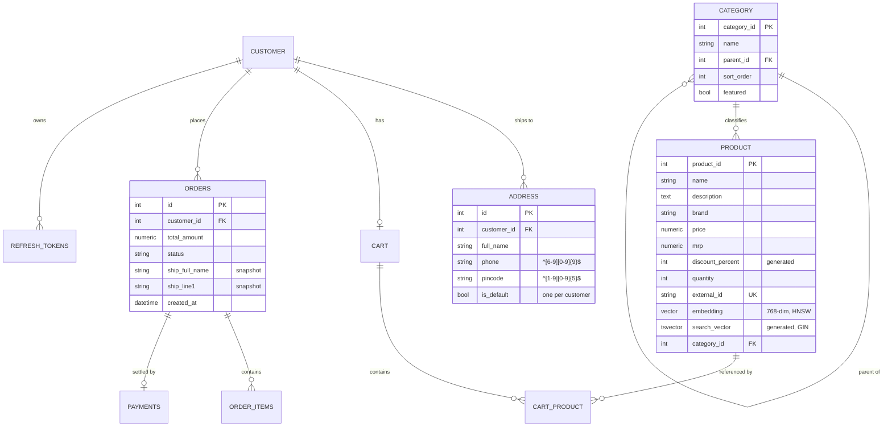

<div align="center">

<br/>


<br/><br/>

# 🛒 ShopKart

### An Indian marketplace built on Spring Boot and React — 50,000 products, hybrid semantic search, and a Gemini shopping assistant

<br/>

[](http://13.50.19.252)
[](https://openjdk.org/)
[](https://spring.io/projects/spring-boot)
[](https://react.dev/)
[](https://mui.com/)
[](https://www.postgresql.org/)
[](https://github.com/pavansaiambala7/ecommerce_project_spring-boot/actions/workflows/deploy.yml)

<br/>

### 🔗 [**Open the live store → 13.50.19.252**](http://13.50.19.252)

<sub>Sign in as `admin` / `123` for the store admin, or `lisa` / `765` as a shopper.<br/>
Served over plain HTTP, so the browser will call it "Not secure" and "use my location" at checkout will not work — see [Known limitations](#-known-limitations).</sub>

<br/>

<p>
  <a href="#-quick-start">Quick Start</a> •
  <a href="#-how-search-works">How Search Works</a> •
  <a href="#-architecture">Architecture</a> •
  <a href="#-features">Features</a> •
  <a href="#-api-reference">API Reference</a> •
  <a href="#-database-schema">Database Schema</a> •
  <a href="#-the-catalogue">The Catalogue</a> •
  <a href="#-deployment">Deployment</a> •
  <a href="#-testing">Testing</a>
</p>

</div>

<br/>

---

<br/>

## 📖 Overview

One Spring Boot application — not a microservice fleet — serving a React single-page storefront from its own static resources, so the UI and the API share an origin and CORS never enters the picture in production.

| Layer | What it is |
|-------|------------|
| **Storefront** | React 18 + Vite + Material UI 6, built into `src/main/resources/static/` |
| **API** | Stateless JSON over JWT bearer tokens |
| **Data** | PostgreSQL 16 with `pgvector`, `pg_trgm`, full-text search and a materialized view |
| **AI** | Google Gemini through LangChain4j — embeddings for search, chat for the assistant |

The catalogue holds **~50,000 generated products across 23 departments**, which is the point: every design decision below (indexing, fusion, paging, suggestion caching) only matters at that size. At a hundred rows, none of it would.

<br/>

---

<br/>

## ⚡ Quick Start

### 🐳 Docker Compose *(recommended)*

```bash
# A signing secret is required — the app refuses to boot without one
export JWT_SECRET=$(openssl rand -base64 48)

# Optional: the assistant and semantic search stay inert without this
export GEMINI_API_KEY=your-key

docker compose up --build
```

The store comes up on **http://localhost:8080** with the 96-product seed catalogue.

### 🔧 Without Docker

```bash
# PostgreSQL with the pgvector extension
docker run -d --name ecomm-db -p 5432:5432 \
  -e POSTGRES_PASSWORD=postgres -e POSTGRES_DB=ecommjava \
  pgvector/pgvector:pg16

export JWT_SECRET=$(openssl rand -base64 48)

# Build the SPA into the backend's static resources, then run
cd frontend && npm install && npm run build && cd ..
./mvnw spring-boot:run
```

### 🎨 Working on the UI

```bash
cd frontend && npm run dev     # http://localhost:3000, proxies /api to :8080
```

Point the proxy in `frontend/vite.config.js` at a deployed host to develop against a real catalogue instead of the seed.

### 🔑 Demo accounts

| Username | Password | Role |
|:--------:|:--------:|:----:|
| `admin` | `123` | `ROLE_ADMIN` |
| `lisa` | `765` | `ROLE_NORMAL` |

> [!WARNING]
> Seeded by a migration in **every** environment, including the live demo. Rotate or delete them before this is anything but a demo.

<br/>

---

<br/>

## 🔍 How Search Works

The part worth reading. Searching 50,000 products well needs two different kinds of matching, because each is bad at what the other is good at:

- **Lexical** (`tsvector` + GIN) nails exact tokens — `Sony WH-1000XM5`, `Redmi Note 13` — and is useless for intent.
- **Vector** (`pgvector` HNSW, cosine) understands *"something to keep coffee hot"* and is unreliable on model numbers, because an embedding does not know that `XM5` differs from `XM4`.

Both run, each returns a ranked pool of 200, and the two rankings are fused with **Reciprocal Rank Fusion**:

```
score(d) = Σ  1 / (k + rank_i(d))        k = 60
```

RRF combines *positions*, not scores, so it needs no normalisation between two scales that have nothing to do with each other — which is exactly why it beats a weighted sum here.

Three details that took measuring to get right:

| Problem | Fix |
|---------|-----|
| `PgVectorEmbeddingStore` wrapped its query so pgvector never used the HNSW index — a sequential scan over every embedding | Dropped that retrieval path; vectors live on `product.embedding` and are queried with a direct `ORDER BY embedding <=> :q LIMIT k` |
| Vector search returned confidently unrelated items for short queries | `app.search.max-vector-distance=0.40`, calibrated against real result sets |
| `totalItems: 0` printed above a full page of results | The count counts the *fused* set, not one of the two halves |

**Suggestions** (the dropdown under the search box) come from a `search_term` materialized view of words, phrases, brands and department names, matched with `pg_trgm` so `aple` still finds Apple. The browser debounces 150 ms, caches by prefix, and aborts the in-flight request when you keep typing — so `apple` is one round trip, not five, and a slow answer for `ap` can never overwrite the answer for `apple`.

<br/>

---

<br/>

## 🏗 Architecture

```
React SPA  ──►  Rate limit (Bucket4j)  ──►  JWT filter  ──►  @PreAuthorize  ──►  Controller
                                                                                     │
                                                                                     ▼
                                                                                  Service
                                                                                 (@Transactional)
                                                                                     │
                                                          ┌──────────────────────────┼──────────────┐
                                                          ▼                          ▼              ▼
                                                    DAO / JPA              Native SQL (search)   Gemini
                                                          └──────────────────────────┴──────────────┘
                                                                          PostgreSQL 16 + pgvector
```

### Layer responsibilities

| Layer | Owns | Never does |
|-------|------|------------|
| **Controller** | HTTP shape, status codes, validation | Business rules, SQL |
| **Service** | Transactions, invariants, authorization checks | HTTP concepts |
| **DAO** | Persistence, native queries | Decide who may call it |
| **DTO** | The public shape of a response | Leak entities — `ProductResponse` deliberately drops the owning customer, which once exposed a password hash |

### Why it is one application

Every table in a checkout — cart, order, order items, payment, stock — has to move together or not at all. Split across services, that becomes a distributed transaction with compensating actions; here it is one `@Transactional` method and a row lock. The AI layer is the only genuinely separable piece, and it is already isolated behind an interface that returns degraded results when Gemini is unavailable.

<br/>

---

<br/>

## ✨ Features

<table>
<tr>
<td width="50%">

### 🔐 Authentication & security
- **JWT access + refresh** — 15 min / 7 day rotation
- Refresh tokens stored as **SHA-256 hashes**
- **Rotate on use** — a stolen token works at most once
- Per-session and account-wide revocation
- No user enumeration on login
- Ownership checks on every `/{id}` route

</td>
<td width="50%">

### 🚦 Rate limiting
Bucket4j, **ahead of** Spring Security so an unauthenticated flood is cheap to reject.

| Endpoint | Limit |
|----------|-------|
| `/api/chat/**` | 10 / min |
| `/api/search/reindex` | 2 / hour |
| `/api/search/**` | 30 / min |
| Auth endpoints | 5 / min |
| `/api/**` | 100 / min |

`429` carries `Retry-After`; the UI surfaces it rather than retrying and burning the remaining budget.

</td>
</tr>
<tr>
<td>

### 🛒 Cart & checkout
- Amazon-style stepped checkout: address → payment → review
- **Stock row-lock at checkout** — no overselling
- **Idempotency keys** — a double-click makes one order
- Cash on delivery or **Razorpay** (signature re-derived server-side; the page never sees the secret)
- Shipping address **snapshotted** onto the order, so editing it later cannot rewrite history

</td>
<td>

### 📍 Addresses
- Address book with a single enforced default (partial unique index)
- **PIN code autofill** — six digits fills city and state
- **Use my current location** — reverse-geocoded into street, city, state, PIN
- Validation at the database, not just the form: PIN `^[1-9][0-9]{5}$`, phone `^[6-9][0-9]{9}$`

</td>
</tr>
<tr>
<td>

### 🤖 AI
- **Hybrid search** — see [How Search Works](#-how-search-works)
- **Shopping assistant** with catalogue and order retrieval
- **Model fallback chain** — a retired or overloaded model fails over with a cooldown instead of taking the chatbot down, which is exactly how it broke once
- Degrades to retrieval-only rather than erroring
- Entirely inert without `GEMINI_API_KEY`

</td>
<td>

### 🎨 Storefront
- React 18 + **Material UI 6**, one theme rather than scattered CSS
- Department mega-menu, faceted filters, discount and price sorting
- Search suggestions with typo tolerance
- Works down to 390 px — no horizontal scroll
- Admin area: products, departments, customers, bulk import

</td>
</tr>
</table>

<br/>

---

<br/>

## 📡 API Reference

All responses share one envelope:

```json
{ "success": true, "message": "Success", "data": { } }
```

<details>
<summary><b>Authentication</b></summary>

| Method | Path | Auth | Notes |
|--------|------|:----:|-------|
| `POST` | `/api/auth/register` | — | Returns a token pair |
| `POST` | `/api/auth/login` | — | 5 / min per IP |
| `POST` | `/api/auth/refresh` | — | Rotates; the presented token is revoked |
| `POST` | `/api/auth/logout` | 🔒 | Revokes one session |
| `POST` | `/api/auth/logout-all` | 🔒 | Revokes every session |

</details>

<details>
<summary><b>Catalogue & search</b></summary>

| Method | Path | Auth | Notes |
|--------|------|:----:|-------|
| `GET` | `/api/products/search` | — | `q`, `categoryId`, `minPrice`, `maxPrice`, `minDiscount`, `inStockOnly`, `sort`, `page`, `size` |
| `GET` | `/api/products/suggest` | — | Typeahead; `q`, `limit` |
| `GET` | `/api/products/facets` | — | Counts per department, price range |
| `GET` | `/api/products/{id}` | — | |
| `POST` `PUT` `DELETE` | `/api/products`, `/api/products/{id}` | 👑 | |
| `GET` | `/api/categories/tree` | — | Departments nested, with counts |
| `GET` | `/api/storefront/home` | — | Landing cards and deals |

</details>

<details>
<summary><b>Cart, orders, payments</b></summary>

| Method | Path | Auth | Notes |
|--------|------|:----:|-------|
| `GET` `DELETE` | `/api/cart` | 🔒 | |
| `POST` | `/api/cart/items` | 🔒 | |
| `PUT` `DELETE` | `/api/cart/items/{productId}` | 🔒 | |
| `POST` | `/api/cart/checkout` | 🔒 | `Idempotency-Key` header |
| `GET` | `/api/orders/me` | 🔒 | |
| `POST` | `/api/orders/{id}/cancel` | 🔒 | Owner only |
| `PATCH` | `/api/orders/{id}/status` | 👑 | |
| `POST` | `/api/payments` | 🔒 | Cash on delivery |
| `POST` | `/api/payments/razorpay/orders/{orderId}` | 🔒 | Opens a Razorpay session |
| `POST` | `/api/payments/razorpay/confirm` | 🔒 | Signature verified server-side |

</details>

<details>
<summary><b>Addresses, geo, assistant, admin</b></summary>

| Method | Path | Auth | Notes |
|--------|------|:----:|-------|
| `GET` `POST` | `/api/addresses` | 🔒 | |
| `PUT` `DELETE` | `/api/addresses/{id}` | 🔒 | Owner only |
| `POST` | `/api/addresses/{id}/default` | 🔒 | |
| `GET` | `/api/geo/pincode/{pincode}` | 🔒 | City and state from a PIN |
| `GET` | `/api/geo/reverse` | 🔒 | `lat`, `lng` → address |
| `POST` | `/api/chat` | 🔒 | 10 / min |
| `POST` | `/api/admin/catalogue/import` | 👑 | Streams a CSV or `.gz` as the raw body |
| `GET` `POST` `DELETE` | `/api/admin/catalogue/embeddings` | 👑 | Start, stop and poll the embedding job |

</details>

<sub>— public · 🔒 authenticated · 👑 `ROLE_ADMIN`</sub>

<br/>

---

<br/>

## 🗄 Database Schema

Sixteen Flyway migrations build the schema incrementally. `ddl-auto=validate`, so a drift between entity and column fails the boot instead of silently altering a production table.



| Migration | What it did |
|:---------:|-------------|
| `V1` | Customers, categories, products |
| `V2` | `pgvector` extension and vector columns |
| `V3` | Orders, order items, payments |
| `V4` | BCrypt the seeded passwords |
| `V5` | Money → `numeric(12,2)` |
| `V6` | Refresh token storage |
| `V7` | Cart quantity |
| `V8` | 96 realistic seed products |
| `V9` | Catalogue at scale — `brand`, `rating`, `external_id`, generated `search_vector` + GIN, retuned HNSW, dropped the old `product_embeddings` table |
| `V10` | Idempotent request records |
| `V11` | Rate-limit buckets |
| `V12` | Razorpay order and payment columns |
| `V13` | Prices restated in rupees |
| `V14` | Department **tree**, `mrp` + generated `discount_percent`, `address` table, order address snapshot, `search_term` materialized view |
| `V15` | Real photographs for the grocery seed |
| `V16` | Real photographs for 116 more product lines — catalogue photo coverage 30% → 55% |

<br/>

---

<br/>

## 📦 The Catalogue

The 50,000 products are **generated, not scraped**. Amazon's product data and images belong to Amazon and its brands, and their terms forbid reuse — so `tools/generate_catalogue.py` builds a catalogue from a hand-written taxonomy of departments, brands, product lines, variants, attributes and colours:

```bash
cd tools
python generate_catalogue.py --count 50000 --out catalogue.csv
gzip -k catalogue.csv
```

Upload it from **Admin → Catalogue import**. The file streams up as the raw request body and lands through PostgreSQL `COPY`, so a 12 MB CSV never sits in memory in the browser or the server. Rows are matched on `external_id`, which makes re-importing the same file an update rather than 50,000 duplicates.

### Product photographs

Photos come from two sources that are genuinely free to use — **[DummyJSON](https://dummyjson.com)**, published for demo shops, and **StockSnap via [Openverse](https://openverse.org)** under CC0. `tools/fetch_catalogue_images.py` searches both and writes `tools/catalogue_images.json`.

Search results cannot be trusted unreviewed: a stock search for *"baby wipes"* returned a bull, and *"car battery"* a clock. So the committed file is a **reviewed** set — every photo was checked by eye against the line it illustrates, and anything that did not show the product was deleted rather than shipped.

A photo illustrates the *kind* of product, not the exact model: a Redmi Note 13 gets a real smartphone photograph, not that phone. Where no honest photograph exists — Indian ethnic wear, household cleaning supplies — the product shows a **tinted tile naming the product type**, in its department's colour. That is deliberate. Putting a stock photo of an evening gown on a *Printed Kurti* would be worse than saying nothing.

<br/>

---

<br/>

## 🚀 Deployment

GitHub Actions → ECR → EC2, with **no static AWS credentials anywhere**:

```
push to main
     │
     ▼
 ./mvnw verify          201 tests, real PostgreSQL via Testcontainers
     │
     ▼
 OIDC federation        GitHub mints a short-lived token; AWS trusts this repo's
     │                  main branch only — no access key is ever stored
     ▼
 docker build + push    BuildKit cache mounts for ~/.m2 and ~/.npm
     │
     ▼
 SSM Run Command        runs deploy/deploy.sh on the instance tagged
     │                  Name=ecommerce-app — no inbound SSH, no key pair
     ▼
 health gate            polls /actuator/health/readiness before reporting success
```

The IAM policy is scoped to one ECR repository and one instance tag; `deploy/iam/` holds both documents. Full walkthrough in **[deploy/README.md](deploy/README.md)**.

<br/>

---

<br/>

## 🧪 Testing

```bash
./mvnw verify                      # 201 tests + JaCoCo report
./mvnw test -Dtest=CartIntegrationTest
```

| Kind | What it covers |
|------|----------------|
| **Unit** | Services with mocked collaborators |
| **`@WebMvcTest`** | Controller shape, status codes, validation |
| **Integration** | Real PostgreSQL 16 + pgvector via **Testcontainers** — migrations run, so a broken migration fails the build |
| **Authorization matrix** | Every route driven through the **real filter chain**: anonymous, wrong user, admin |

Integration tests need a working Docker daemon. Without one they do not silently skip — they fail, loudly, which is the point.

> A worked example of why these exist: deleting a cart item appeared to succeed but the row came back, because `cascade = ALL` re-persisted the child that had just been removed from the parent's collection. The fix was two lines. The test that now guards it was written first, watched to fail with `expected: <[2]> but was: <[1, 2]>`, and only then made to pass.

<br/>

---

<br/>

## 📁 Project Structure

```
├── frontend/                     React 18 + Vite + Material UI 6
│   ├── src/theme.js              the single source of the storefront's look
│   ├── src/components/           Header, SearchBox, ProductCard, ChatWidget, …
│   ├── src/pages/                storefront pages and the admin area
│   ├── src/context/              Auth, Cart, Address
│   └── src/hooks/useCatalog.js   shared catalogue loaders
│
├── src/main/java/…/
│   ├── controller/               REST controllers, one per resource
│   ├── services/                 transactions and business rules
│   ├── dao/                      persistence, native search SQL
│   ├── dto/                      request and response shapes
│   ├── catalogue/                import, suggestions, storefront assembly
│   ├── ai/                       Gemini config, embedding job, assistant
│   ├── security/                 JWT filter, entry points, authorization
│   ├── ratelimit/                Bucket4j filter and tiers
│   ├── idempotency/              replay-safe request records
│   ├── payment/                  Razorpay integration
│   └── geo/                      PIN lookup and reverse geocoding
│
├── src/main/resources/db/migration/    V1 … V16
├── src/main/resources/static/          the built SPA (generated)
├── tools/                              catalogue generator and image fetcher
├── deploy/                             deploy scripts, IAM policies, runbook
└── .github/workflows/deploy.yml        the pipeline above
```

<br/>

---

<br/>

## ⚠ Known limitations

Worth stating plainly rather than leaving to be discovered:

| | |
|---|---|
| **No TLS** | The demo is plain HTTP. Browsers therefore refuse `navigator.geolocation`, so **"use my current location" cannot work on the live site** — PIN code autofill is the path that does. Fixing this needs a certificate and a domain. |
| **Seeded credentials** | `admin` / `123` exists in every environment, by migration. |
| **Photo coverage** | About 55% of the catalogue carries a real photograph; the rest show a labelled tile, because no CC0 photograph honestly depicts a *Kurta Pyjama Set* or a bottle of *Dishwash Gel*. See [Product photographs](#product-photographs). |
| **Embeddings are slow to build** | The free Gemini tier allows 100 embeddings a minute, so embedding all 50,000 products takes about eight hours. The job is resumable and runs in the background; lexical search works throughout. |
| **Single instance** | One `t3.small`, no load balancer, no replica. Deploys are a brief restart. |

<br/>

---

<br/>

## 🛠 Tech Stack

| | |
|---|---|
| **Language** | Java 17 |
| **Framework** | Spring Boot 3.2.5 — Web, Data JPA, Security, Validation, Actuator |
| **Frontend** | React 18, Vite 5, Material UI 6, Emotion, React Router 6 |
| **Database** | PostgreSQL 16, pgvector, pg_trgm, Flyway |
| **AI** | LangChain4j 0.35 + Google Gemini (`gemini-embedding-001`, `gemini-3.6-flash`) |
| **Auth** | JJWT, BCrypt |
| **Payments** | Razorpay |
| **Rate limiting** | Bucket4j (Caffeine + PostgreSQL) |
| **Testing** | JUnit 5, Mockito, Testcontainers, JaCoCo |
| **Build & deploy** | Maven, Docker, GitHub Actions, AWS ECR + EC2 + SSM |

<br/>

---

<br/>

## 📄 License

Educational project. Product photographs are DummyJSON and CC0 StockSnap images, credited in `tools/catalogue_images.json`; no Amazon content is used or redistributed.
