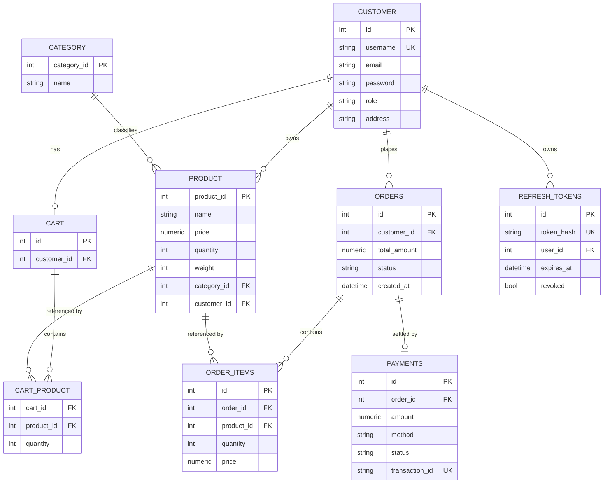

<div align="center">

# 🛒 E-Commerce Platform

### A Spring Boot storefront with a JWT-secured REST API and Gemini-powered AI search

[](https://openjdk.org/)
[](https://spring.io/projects/spring-boot)
[](https://www.postgresql.org/)
[](https://github.com/pgvector/pgvector)
[](https://www.docker.com/)
[](#authentication)
[](https://github.com/pavansaiambala7/ecommerce_project_spring-boot/actions/workflows/ci.yml)

</div>

<p align="center">
  
</p>

<p align="center"><sub>The diagram above is a live SVG — open this file on GitHub to see the request/response flow animate.</sub></p>

---

## Contents

- [What this is](#what-this-is)
- [Features](#features)
- [Tech stack](#tech-stack)
- [Quick start](#quick-start)
- [Configuration](#configuration)
- [Authentication](#authentication)
- [REST API](#rest-api)
- [Database schema](#database-schema)
- [Rate limiting](#rate-limiting)
- [Project structure](#project-structure)
- [Testing](#testing)
- [AI features](#ai-features)
- [Security notes](#security-notes)
- [License](#license)

---

## What this is

A **single Spring Boot application** — not a microservice fleet — with two front doors onto the same domain layer:

- a server-rendered **JSP storefront** with session/form login, and
- a **stateless JWT REST API** for programmatic and mobile clients,

backed by PostgreSQL + pgvector, with optional AI product search and a support chatbot powered by Google Gemini.

## Features

| | |
|---|---|
| 🔐 **JWT auth** | Access + rotating refresh tokens, hashed at rest, revocable per-session or account-wide |
| 🛡️ **Authorization matrix** | Role- and ownership-based access control on every `/api/**` route, enforced in the filter chain and tested end-to-end |
| 🚦 **Rate limiting** | Bucket4j token buckets ahead of Spring Security, tiered per endpoint, IP-keyed |
| 🌐 **CORS** | Explicit origin allow-list, never a wildcard combined with credentials |
| ♻️ **Global error handling** | One consistent JSON error envelope across validation, auth, business-rule and unexpected failures |
| 🛒 **Cart & checkout** | Add / update / remove / checkout, converting a cart into an order under a stock row-lock |
| 🤖 **RAG product search** | Query → Gemini embedding → pgvector cosine search → ranked results |
| 💬 **AI support chat** | Gemini chat with retrieved product/order context and bounded per-user session memory |
| 🧱 **Flyway migrations** | Seven versioned migrations, schema validated against the entities on every boot |
| ✅ **154 tests** | Unit, `@WebMvcTest` slices, and full-context integration tests against real PostgreSQL |

## Tech stack

| Layer | Technology |
|---|---|
| Language / runtime | Java 17 |
| Framework | Spring Boot 3.2.5, Spring Security 6, Spring Data JPA |
| Database | PostgreSQL 16 + pgvector, Flyway |
| AI / LLM | Google Gemini (`gemini-embedding-001`, `gemini-2.0-flash`), LangChain4j |
| Auth | JJWT (HS256), BCrypt |
| Rate limiting | Bucket4j + Caffeine |
| Views | JSP, JSTL |
| Testing | JUnit 5, Mockito, Testcontainers, JaCoCo |
| Build / CI | Maven, Docker, GitHub Actions, Jenkins |

---

## Quick start

### Docker Compose (recommended)

```bash
export JWT_SECRET="$(openssl rand -base64 48)"   # required — see Configuration
export GEMINI_API_KEY="your-gemini-api-key"      # optional — AI features only
docker compose up --build
```

The app comes up on **http://localhost:8080**. Compose refuses to start without `JWT_SECRET`.

### Without Docker

You need a JDK 17 and a PostgreSQL 16 with the `vector` and `pg_trgm` extensions. The `pgvector/pgvector:pg16` image is the easiest source:

```bash
docker run -d --name ecommerce-db -p 5432:5432 \
  -e POSTGRES_DB=ecommjava -e POSTGRES_USER=postgres -e POSTGRES_PASSWORD=postgres \
  pgvector/pgvector:pg16

export JWT_SECRET="$(openssl rand -base64 48)"
./mvnw spring-boot:run -Dspring-boot.run.profiles=dev
```

Flyway creates and migrates the schema on startup. The `dev` profile enables SQL logging and a throwaway JWT secret if you haven't set one.

### Demo accounts

| Username | Password | Role |
|---|---|---|
| `admin` | `123` | `ROLE_ADMIN` |
| `lisa` | `765` | `ROLE_NORMAL` |

⚠️ **These are well-known credentials seeded by a migration that runs in every environment.** Rotate or delete them before this touches anything real — see [Security notes](#security-notes).

---

## Configuration

Everything is read from the environment. Only `JWT_SECRET` is mandatory.

| Variable | Default | Purpose |
|---|---|---|
| `JWT_SECRET` | *(none — startup fails)* | HMAC-SHA signing key, ≥ 32 bytes |
| `SPRING_DATASOURCE_URL` | `jdbc:postgresql://localhost:5432/ecommjava` | Database URL |
| `SPRING_DATASOURCE_USERNAME` | `postgres` | Database user |
| `SPRING_DATASOURCE_PASSWORD` | `postgres` | Database password |
| `GEMINI_API_KEY` | *(empty)* | Enables AI search and chat |
| `CORS_ALLOWED_ORIGINS` | `http://localhost:3000,http://localhost:8080` | Comma-separated allow-list |
| `RATELIMIT_TRUST_XFF` | `false` | Trust `X-Forwarded-For` for rate-limit identity |

There is **deliberately no default signing secret**. A fallback baked into source control is equivalent to no authentication, so the app refuses to boot without one. Set `RATELIMIT_TRUST_XFF=true` only behind a proxy you control that overwrites the header — otherwise callers set it themselves and the limiter does nothing.

---

## Authentication

The REST API is stateless and authenticates with JWT bearer tokens. The JSP pages use ordinary session form-login and are unaffected.

```bash
curl -s -X POST localhost:8080/api/auth/login \
  -H 'Content-Type: application/json' \
  -d '{"username":"admin","password":"123"}'

curl -s localhost:8080/api/cart -H "Authorization: Bearer $ACCESS_TOKEN"
```

Access tokens last 15 minutes. Refresh tokens last 7 days, are stored only as a SHA-256 hash, and **rotate on every use** — a stolen refresh token is usable at most once before the legitimate client's next refresh invalidates it. `/api/auth/logout` revokes one session; `/api/auth/logout-all` revokes every session for the account.


---

## REST API

`—` = no authentication required. Every response uses one envelope:

```json
{ "success": true, "message": "Success", "data": {}, "timestamp": "..." }
```

Validation failures add an `errors` object keyed by field name.

<details>
<summary><strong>Auth</strong></summary>

| Method | Path | Access |
|---|---|---|
| POST | `/api/auth/login` | — |
| POST | `/api/auth/register` | — |
| POST | `/api/auth/refresh` | — |
| POST | `/api/auth/logout` | authenticated |
| POST | `/api/auth/logout-all` | authenticated |

</details>

<details>
<summary><strong>Products</strong></summary>

| Method | Path | Access |
|---|---|---|
| GET | `/api/products`, `/api/products/paged`, `/api/products/{id}` | — |
| POST | `/api/products` | admin |
| PUT | `/api/products/{id}` | admin |
| DELETE | `/api/products/{id}` | admin |

`/api/products/paged` accepts `page`, `size` (1–100), `sortBy` (`id`, `name`, `price`, `quantity`, `weight`) and `direction`.

</details>

<details>
<summary><strong>Cart</strong></summary>

| Method | Path | Access |
|---|---|---|
| GET | `/api/cart` | authenticated (own cart) |
| POST | `/api/cart/items` | authenticated |
| PUT | `/api/cart/items/{productId}` | authenticated |
| DELETE | `/api/cart/items/{productId}` | authenticated |
| DELETE | `/api/cart` | authenticated |
| POST | `/api/cart/checkout` | authenticated |

</details>

<details>
<summary><strong>Orders &amp; payments</strong></summary>

| Method | Path | Access |
|---|---|---|
| POST | `/api/orders` | authenticated (billed to the caller) |
| GET | `/api/orders/me` | authenticated |
| GET | `/api/orders/{id}` | owner or admin |
| GET | `/api/orders/user/{userId}` | self or admin |
| POST | `/api/orders/{id}/cancel` | owner or admin |
| PATCH | `/api/orders/{id}/status` | admin |
| POST | `/api/payments` | owner of the order |
| GET | `/api/payments/order/{orderId}` | owner or admin |
| POST | `/api/payments/refund/{orderId}` | admin |

</details>

<details>
<summary><strong>Users</strong></summary>

| Method | Path | Access |
|---|---|---|
| GET | `/api/users` | admin |
| GET | `/api/users/me` | authenticated |
| GET | `/api/users/{id}` | self or admin |
| PUT | `/api/users/{id}` | self or admin |

</details>

<details>
<summary><strong>AI</strong></summary>

| Method | Path | Access |
|---|---|---|
| GET | `/api/search?q=…&limit=…` | — |
| POST | `/api/search/reindex` | admin |
| POST | `/api/chat` | authenticated |
| DELETE | `/api/chat/history/{sessionId}` | authenticated |

</details>

---

## Database schema

Seven Flyway migrations (`V1`–`V7`) build this incrementally — money as `numeric(12,2)`, a unique cart per customer, hashed refresh tokens, and the `pgvector` embedding store alongside it.



A `product_embeddings` table (UUID key, `vector(768)`, JSONB metadata) backs AI search. It's linked to `product` by a `productId` value in its metadata rather than a foreign key, since LangChain4j owns that table's shape.

---

## Rate limiting

A Bucket4j token-bucket filter runs **ahead of Spring Security**, so throttled traffic costs no authentication work and the login endpoints are themselves protected against credential stuffing. Buckets are keyed by client address and held in a bounded, expiring cache.

| Path | Limit |
|---|---|
| `/api/chat/**` | 10 / minute |
| `/api/search/reindex` | 2 / hour |
| `/api/search/**` | 30 / minute |
| login, register, refresh | 5 / minute |
| `/api/**` | 100 / minute |

Responses carry `X-RateLimit-Limit` / `X-RateLimit-Remaining`; a `429` also carries `Retry-After`. Tiers are configurable under `app.ratelimit.tiers`.

---

## Project structure

```
controller/        JSP controllers (admin, storefront, cart)
controller/api/    REST controllers
dto/               Request and response DTOs — entities are never serialised
security/          JWT issuing/verification, principal, auth service
ratelimit/         Bucket4j filter and configuration
exception/         Domain exceptions and the global handlers
services/ dao/     Business logic and Spring Data repositories
models/            JPA entities
ai/                Gemini embeddings, pgvector RAG search, support chat
resources/db/      Flyway migrations V1–V7
```

Entities are never returned from a controller — every endpoint maps to a DTO, which is what keeps password hashes out of responses and breaks the `Order → OrderItem → Order` cycle that would otherwise send Jackson into infinite recursion.

`spring.jpa.open-in-view` is disabled; read paths that render an association fetch it explicitly with `@EntityGraph` rather than lazily loading it during view rendering.

---

## Testing

```bash
./mvnw verify
```

**154 tests** — JUnit 5, Mockito, `@WebMvcTest` slices, and full-context integration tests — passed on the last full run, with JaCoCo coverage written to `target/site/jacoco/`.

Integration tests need PostgreSQL with pgvector. By default they start one via Testcontainers; if `SPRING_DATASOURCE_URL` is already set, that database is used instead — useful when the build itself runs inside a container. `JtSpringProjectApplicationTests` boots the whole application, exercising every Flyway migration and Hibernate's schema validation against the result.

The authorization matrix — the surface that mattered most — is tested by running the **real filter chain**, not just mocked services: anonymous callers are confirmed unable to list users, change passwords, mutate the catalogue, create orders, refund payments, or trigger a reindex.

---

## AI features

Both are optional and inert without `GEMINI_API_KEY`.

- **RAG product search** embeds the query with Gemini, searches pgvector by cosine similarity, and returns ranked products with scores.
- **Support chat** augments the conversation with retrieved product/order context. Sessions are namespaced per user and held in a bounded cache.

`POST /api/search/reindex` rebuilds the embedding store — it clears existing vectors first, and is admin-only and heavily rate-limited, since a reindex issues one paid embedding request per product.

> `pgvector.dimension` (768) must match the embedding model's output. `gemini-embedding-001` returns 3072 dimensions by default, so `GeminiConfig` explicitly requests 768 via `outputDimensionality`. Change the model, the property, and the `vector(...)` column in `V2` together.

---

## Security notes

- The seeded `admin` / `lisa` accounts exist for local exploration only. Delete or rotate them before deploying anywhere reachable.
- `JWT_SECRET` has no default — the application will not start without one, on purpose.
- CORS origins are an explicit allow-list; a wildcard is never combined with credentials.
- Refresh tokens are stored as SHA-256 hashes and rotate on every use.
- Password comparison runs even for unknown usernames, so login timing can't be used to enumerate accounts.

---

## License

No license file is included yet. Until one is added, all rights are reserved by default — don't reuse this beyond personal/educational reference without asking.

<div align="center">

<sub>Built with Spring Boot · PostgreSQL · pgvector · Gemini</sub>

</div>
